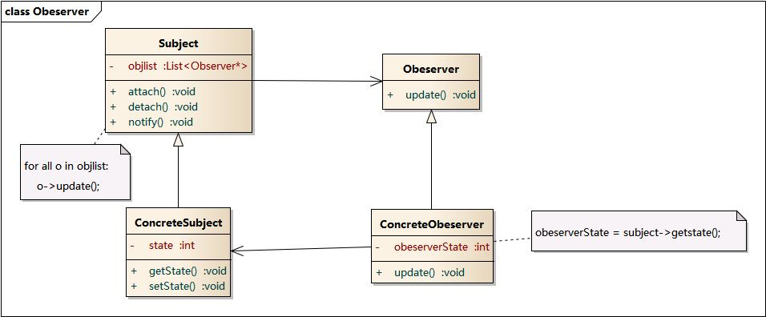

# 设计模式

## 前言

目标：

理解松耦合的设计思想

面向对象的设计原则

重构

核心设计模式

- 软件架构师(高层的设计)
- 软件工程师

软件架构：宏观的

考核方式：大作业（50%）+实验（40%）+考勤（10%）

项目经理：功能需求

软件架构师：软件系统的质量（性能，可扩展性，可部署性）。

软件设计的考虑因素：模块化，可扩展化，性能

软件设计的成功经验：软件设计模式，软件体系结构

- 为什么要使用设计模式？
  - 1.学习专家经验
  - 2.为了交流
  - 3.为了重复利用成功的设计
  - 4.提供设计修改

- 使用设计模式的好处
  - 1.改善设计理解能力
  - 2.改善设计文档
  - 3.

- 复杂性的解决方案
  - 分解
  - 抽象

## 创建型模式

## 结构性模式

## 行为型模式

### 3、观察者模式

#### 3.1模式动机

建立一个对象与对象的依赖关系，一个对象发生改变时自动通知其他对象，其他对象将相应做出反应。

发生改变的对象称为观察目标，而被通知的对象称为观察者，一个观察目标可以对应多个观察者。观察者之间没有联系，可以根据需要增加和删除观察者，使系统容易拓展。

#### 3.2模式定义

观察者模式定义了一种一对多的对象间依赖关系，使得每当一个对象状态发生改变时，其相关的依赖对象都会得到通知并自动更新。又称作发布-订阅模式。

#### 3.3模式结构

观察者模式包含的角色：

- Subject：观察目标
- ConcreteSubject：具体目标
- Observer：观察者
- ConcreteObserver：具体观察者

**主题**是被观察的对象，而其所有依赖者称为被观察者。

